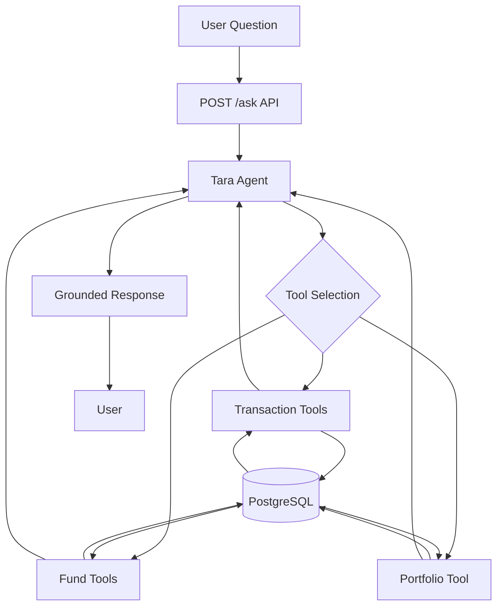
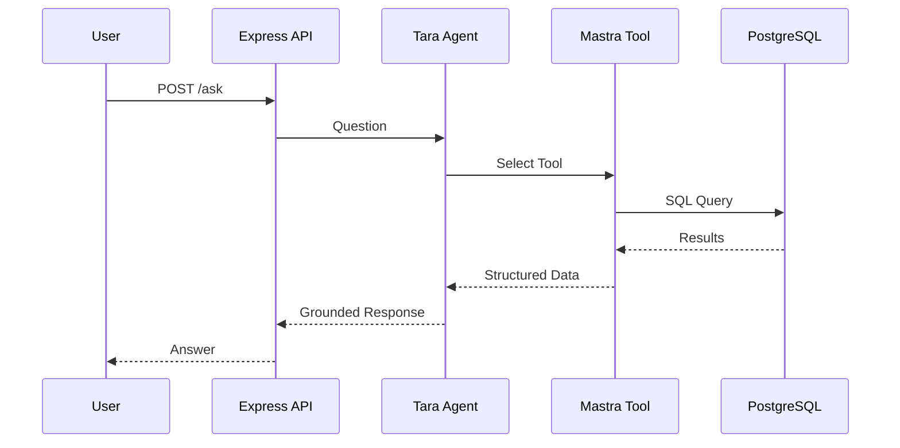
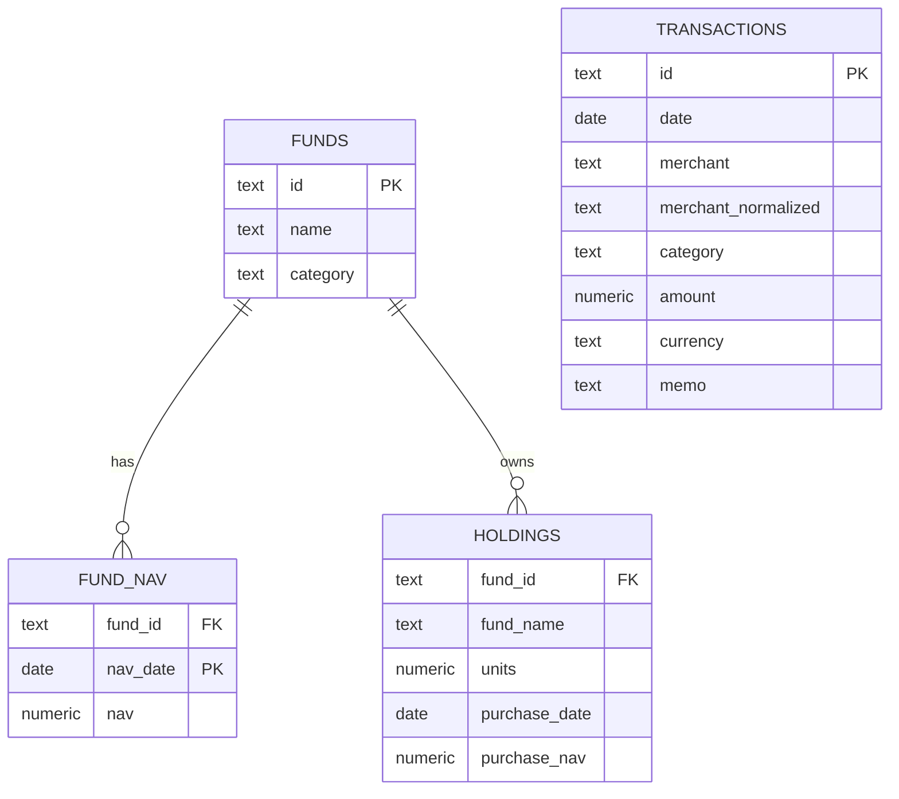
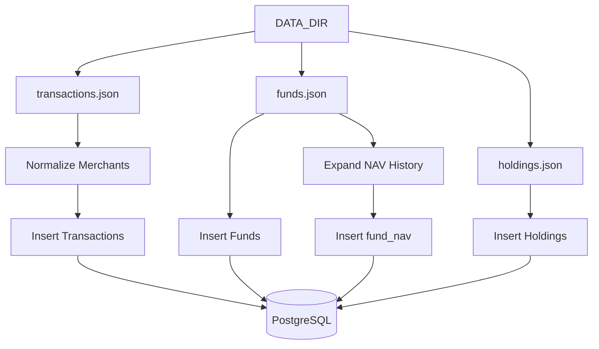
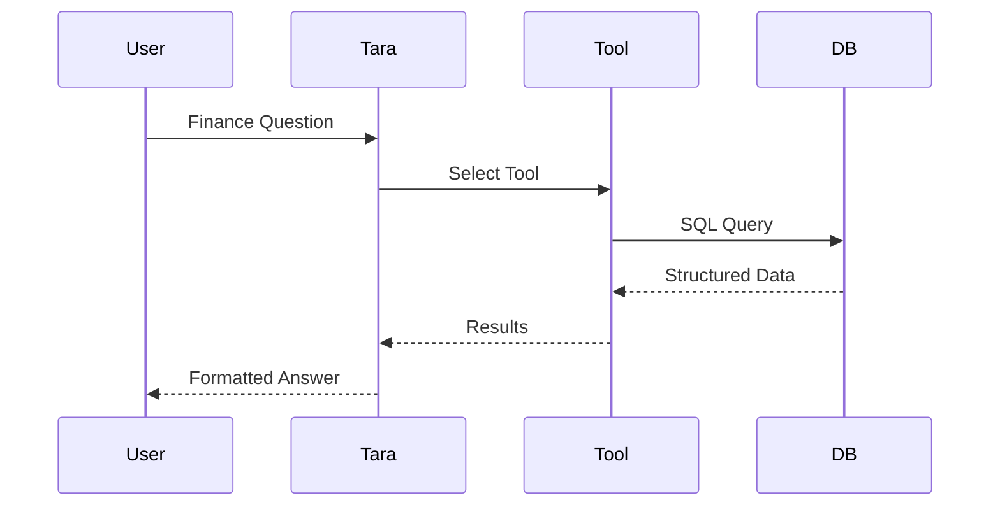
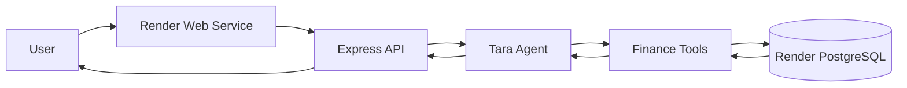

# Design Decisions

## Overview

This project builds **Tara**, a finance research assistant capable of answering natural language questions about transactions, merchants, mutual funds, NAV history, and portfolio holdings.

The solution uses:

* PostgreSQL as the source of truth
* Mastra SDK for agent orchestration and tool-calling
* Express for the public API layer
* Ollama Cloud (`gpt-oss:20b-cloud`) as the model provider
* TypeScript across the entire stack

The primary design principle is:

> Financial facts must come from database-backed tools. The LLM may format answers, but it must never invent financial numbers.

---

# System Architecture



---

# Request Lifecycle



---

# PostgreSQL Schema Design

The schema is normalized into four primary tables:

* transactions
* funds
* fund_nav
* holdings

This separation keeps spending analytics, fund analytics, and portfolio analytics independent and easier to maintain.

---

## transactions

Stores all transaction-level financial activity.

| Column              | Type          |
| ------------------- | ------------- |
| id                  | text          |
| date                | date          |
| merchant            | text          |
| merchant_normalized | text          |
| category            | text          |
| amount              | numeric(12,2) |
| currency            | text          |
| memo                | text          |

Primary Key:

```sql
PRIMARY KEY (id)
```

Purpose:

* Merchant spend analysis
* Category spend analysis
* Monthly spending trends
* Top merchant calculations
* Refund-adjusted net spend

Refunds are stored as negative transaction amounts and therefore automatically reduce spend totals.

---

## funds

Stores mutual fund metadata.

| Column   | Type |
| -------- | ---- |
| id       | text |
| name     | text |
| category | text |

Primary Key:

```sql
PRIMARY KEY (id)
```

Purpose:

* Fund lookup
* Category grouping
* Linking NAV history and holdings

---

## fund_nav

Stores historical NAV values.

| Column   | Type          |
| -------- | ------------- |
| fund_id  | text          |
| nav_date | date          |
| nav      | numeric(10,4) |

Primary Key:

```sql
PRIMARY KEY (fund_id, nav_date)
```

Foreign Key:

```sql
FOREIGN KEY (fund_id)
REFERENCES funds(id)
```

Existing Index:

```sql
idx_nav_fund_date
```

Purpose:

* Fund return calculations
* Fund ranking
* Portfolio valuation

The composite key ensures a fund has only one NAV value per date.

---

## holdings

Stores portfolio positions.

| Column        | Type          |
| ------------- | ------------- |
| fund_id       | text          |
| fund_name     | text          |
| units         | numeric(12,4) |
| purchase_date | date          |
| purchase_nav  | numeric(10,4) |

Foreign Key:

```sql
FOREIGN KEY (fund_id)
REFERENCES funds(id)
```

Purpose:

* Portfolio valuation
* Profit calculations
* Holding-level return calculations

---

# Entity Relationship Diagram



---

# Indexing Strategy

The indexing strategy is driven by the most common query patterns used by Tara's tools.

## Existing Indexes

```sql
transactions_pkey
funds_pkey
fund_nav_pkey
idx_nav_fund_date
```

## Recommended Transaction Indexes

```sql
CREATE INDEX idx_txn_date
ON transactions(date);

CREATE INDEX idx_txn_category
ON transactions(category);

CREATE INDEX idx_txn_merchant
ON transactions(merchant_normalized);
```

These indexes improve:

```sql
WHERE date BETWEEN ?
```

```sql
WHERE category = ?
```

```sql
WHERE merchant_normalized LIKE ?
```

which are common patterns for spend analytics.

---

# Schema Design Rationale

The source dataset contains nested NAV arrays within fund data.

Instead of storing NAV history as JSON, NAV values are expanded into the `fund_nav` table.

Advantages:

* Easier SQL querying
* Simpler return calculations
* Better indexing
* Cleaner joins

Transactions are stored separately because transaction analytics have very different query patterns than portfolio analytics.

Holdings are stored separately because a fund represents a financial instrument while a holding represents a user's position in that instrument.

---

# Data Ingestion Design

The ingestion script accepts any dataset directory through:

```bash
DATA_DIR=./data/sample_a npx tsx src/scripts/ingest.ts
```

Expected structure:

```text
data/
 └── sample_a/
      ├── transactions.json
      ├── funds.json
      └── holdings.json
```

---

## Ingestion Flow



The ingest script clears and reloads the database, making it compatible with hidden evaluation datasets.

---

# Tool Design

Tools are separated by finance domain.

This keeps tool responsibilities focused and reduces hallucination risk.

---

## Transaction Tools

### transactionSummaryTool

Used for:

* Merchant spend
* Category spend
* Total spend
* Refund-adjusted net spend

### topMerchantsTool

Used for:

* Merchant ranking
* Largest spending categories

### monthlySpendTool

Used for:

* Monthly trend analysis
* Spending breakdowns

---

## Fund Tools

### fundReturnTool

Used for:

* Single fund NAV return

### rankFundsByReturnTool

Used for:

* Best performing fund
* Worst performing fund
* Fund comparison

---

## Portfolio Tool

### portfolioSummaryTool

Used for:

* Current value
* Purchase value
* Profit
* Holding-level returns

---

# Why Split Tools?

Instead of exposing one large database tool, I split functionality into focused tools.

Benefits:

* Easier testing
* Better observability
* Smaller prompts
* Lower hallucination risk
* Simpler maintenance

Each tool exposes only the data needed for its domain.

---

# Grounding Strategy

The system prevents fabricated financial numbers.

Answer flow:



The model formats the response, but PostgreSQL provides all financial values.

---

# Financial Formulas

## Net Spend

```text
Net Spend = SUM(amount)
```

Refunds are negative amounts and automatically reduce spend.

---

## Merchant Matching

Normalization process:

```text
1. Convert to uppercase
2. Remove special characters
3. Collapse whitespace
4. Store as merchant_normalized
```

Examples:

```text
SWIGGY
SWIGGY*ORDER
SWIGGY BANGALORE
Swiggy Instamart
```

are mapped to a common normalized merchant representation.

---

## Merchant Ranking

```text
SUM(amount)
GROUP BY merchant_normalized
ORDER BY SUM(amount) DESC
```

---

## Fund Period Return

```text
Return % =
((NAV_end - NAV_start) / NAV_start) × 100
```

---

## Holding Current Value

```text
Current Value =
Units × Latest NAV
```

---

## Holding Purchase Value

```text
Purchase Value =
Units × Purchase NAV
```

---

## Holding Return

```text
Holding Return % =
((Current Value - Purchase Value) / Purchase Value) × 100
```

Fund return and holding return are intentionally treated as separate metrics.

---

# Evaluation Strategy

A repeatable evaluation suite is included.

Location:

```text
eval/eval.ts
```

Coverage:

* Portfolio valuation
* Fund ranking
* Swiggy spend
* Top merchants
* Monthly food spend

Execution:

```bash
npx tsx eval/eval.ts
```

Result:

```text
5 / 5 tests passed
```

---

# Observability

The project includes:

## Request Logs

Captured:

* Timestamp
* Question
* Response

---

## Mastra Studio

Used for:

* Tool traces
* Agent debugging
* Tool execution inspection

---

## Evaluation Logs

Produced through:

```bash
npx tsx eval/eval.ts
```

---

## Evidence Included

Repository screenshots include:

* Successful run
* No-data/failure run
* Passing evaluation output

---

# Failure Handling

Handled scenarios:

## Empty Question

Returns validation error.

## No Matching Data

Returns a safe no-data response.

## Database Errors

Handled using:

```text
try/catch
```

and structured API responses.

## LLM Errors

The API returns a controlled error rather than crashing.

---

# Long-Running Async Tool Milestone

The optional async milestone was not implemented.

The current workloads are small enough to execute synchronously.

If required in production, I would introduce:

* jobs table
* async worker
* status endpoint
* in-progress/completed workflow states

---

# Deployment

The service is deployed on Render and publicly accessible.

Public URL:

```text
https://provue-finance-agent-cwcm.onrender.com
```

Exposed endpoints:

```http
GET /health
POST /ask
```

Deployment architecture:



Hosting components:

| Component | Provider |
|------------|----------|
| API Server | Render Web Service |
| Database | Render PostgreSQL |
| Source Control | GitHub |
| Runtime | Node.js 22 |
| Agent Framework | Mastra SDK |

Deployment process:

1. Push code to GitHub.
2. Render automatically pulls the latest commit.
3. Build step installs dependencies.
4. Express API starts using `npm start`.
5. Application connects to Render PostgreSQL through `DATABASE_URL`.
6. Incoming requests are routed through Tara and PostgreSQL-backed tools.

Environment variables used:

```env
DATABASE_URL=<Render PostgreSQL URL>
OLLAMA_BASE_URL=http://localhost:11434/v1
OLLAMA_MODEL=gpt-oss:20b-cloud
```

Deployment tradeoffs:

- Render free tier introduces cold-start latency after periods of inactivity.
- Render PostgreSQL free tier has storage and connection limitations.
- Ollama Cloud is used during development. Production environments typically require a reachable OpenAI-compatible endpoint or hosted model provider.
- The deployed service uses PostgreSQL-backed fallback logic to ensure responses remain grounded even when model tool-calling is unavailable.

Known limitations:

- No horizontal scaling is currently configured.
- No authentication layer is implemented.
- No rate limiting is currently enforced.
- The system assumes trusted users and a single-tenant environment.

Production readiness improvements:

- Add Redis caching for frequent portfolio queries.
- Add API authentication and rate limiting.
- Add monitoring with OpenTelemetry.
- Add automated database backups.
- Deploy a dedicated hosted LLM endpoint instead of relying on local Ollama development workflows.

---

# Main Failure Modes

Potential failure points:

* Ambiguous date ranges
* Noisy merchant aliases
* Missing NAV history
* LLM tool selection errors
* Provider downtime
* Hidden dataset schema changes

---

# Future Improvements

Given additional time, I would add:

1. Recurring transaction detection
2. Multi-user support
3. Authentication
4. Conversational memory
5. Real-time NAV updates
6. Portfolio allocation analytics
7. Async reporting workflows
8. Stronger evaluation coverage

---

# Conclusion

The final system prioritizes:

* Correctness
* Grounded financial answers
* Observability
* Simplicity
* Extensibility

The LLM determines which tool to use, but PostgreSQL-backed tools remain the source of truth for all financial calculations.
